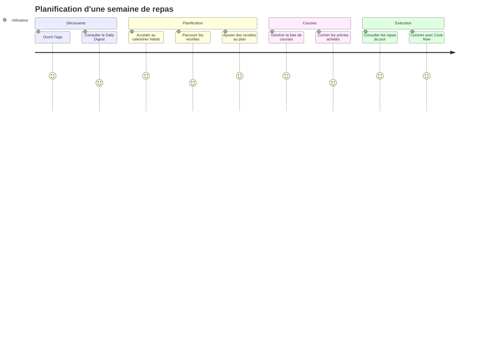
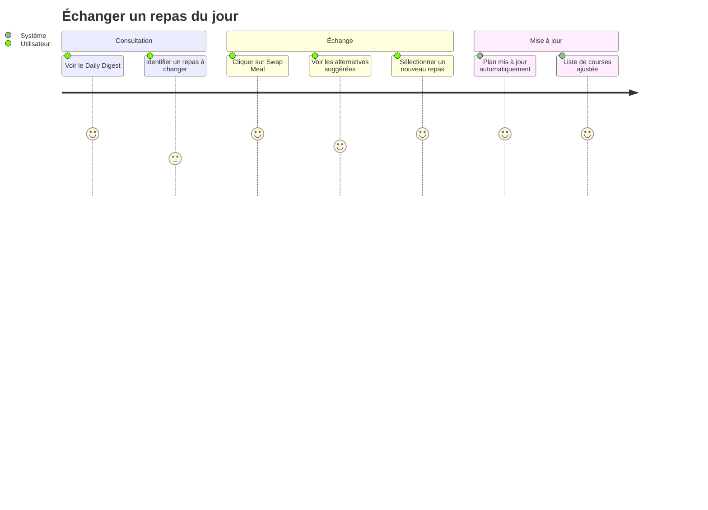

# AGENTS.md

> IMPORTANT: On first conversation message, say "AI-Driven Development ON - Date: {current_date}, TZ: {current_timezone}." to User.

This file contains a collection of config, context, rules, information etc for a project.

The goal is to provide to the ASSISTANT a clear understanding of the project's context, including its structure, dependencies, and any specific conventions that should be followed.

All instructions and information above are willing to be up to date, but always remind yourself that USER can be wrong, be critical of the information provided, and verify it against the project's actual state.

## Roles

- **USER**: The human developer interacting with the AI assistant, providing instructions, feedback, and context about the project.
- **ASSISTANT**: The AI assistant (you) that helps the USER as a senior software engineer. You do orchestrate the development process, ensuring that the code is clean, efficient, and adheres to best practices. Delegate tasks to specialized agents when necessary.

## Important context

- Current date: !`date +%Y-%m-%d`
- Timezone: !`date +%Z`
- The user's timezone and date are defined {current_date} + {current_timezone}, use them for any date-related task.
- Any dates before this are in the past, and any dates after this are in the   future. When the user asks for the 'latest', 'most recent', 'today's', etc.
- Don't assume your knowledge is up to date.

## Mandatory Rules

- **Avoid complexity**: stay simple, pragmatic, effective
- When dealing with github, use `gh` cli
- **No over-engineering**: focus on requirements
- **No silent error**, throw exceptions early
- **No extra feature**, focus only on core functionality
- Always write code that match versions

### Code Quality Standards

- Eliminate duplication ruthlessly
- Express intent clearly through naming and structure
- Make dependencies explicit
- Keep methods small and focused on a single responsibility
- Minimize state and side effects

### Refactoring Guidelines

- Preserve the intent
- Avoid comments on obvious code, make code self-explanatory instead
- Only add code comments when tricky logic is involved

### Testing Guidelines

- Always write tests first for bug fixes
- When testing: never mock functional components

## Answering Guidelines

- Be 100% sure of your answers.
- If unsure, say "I don't know" or ask for clarification.
- Never say "you are right!", prefer anticipating mistakes.

## MEMORY BANK

This section contains project-specific memory bank information, including context, architecture decisions, and implementation details.

The goal is to provide the ASSISTANT with a comprehensive understanding of the project's current state, past decisions, and ongoing context.

All information should be kept up to date and reflect the actual state of the project.

### Context specific to this project

about infra deployment : @docs/memory-bank/infra/DEPLOYMENT.md

Before any frontend task read : @docs/memory-bank/frontend/CONVENTIONS.md

Before any backend task read : @docs/memory-bank/backend/CONVENTIONS.md

---
### PROJECT_BRIEF.md

#### Résumé Exécutif

- **Nom du Projet** : MealPlanner (alias MealPrep)
- **Vision** : Simplifier la planification alimentaire quotidienne et hebdomadaire
- **Mission** : Offrir une application intuitive permettant aux utilisateurs de planifier leurs repas, découvrir des recettes et générer automatiquement leur liste de courses

##### Description Complète

MealPlanner est une application de planification de repas conçue pour aider les utilisateurs à organiser leur alimentation de manière efficace. L'application propose une vue quotidienne (Daily Digest) des repas planifiés, une vue hebdomadaire du plan de repas, un système de découverte de recettes avec filtres personnalisés, et une liste de courses synchronisée automatiquement avec le plan de repas.

#### Contexte

##### Domaine Principal

L'application opère dans le domaine de la **gestion alimentaire personnelle**. Elle répond aux besoins des utilisateurs qui souhaitent :

- Organiser leurs repas à l'avance
- Adapter leur alimentation à leurs préférences et contraintes (allergies, régimes)
- Simplifier leurs courses en générant automatiquement une liste d'ingrédients

##### Langage Ubiquitaire

| Terme | Définition | Synonymes (FR) |
|-------|------------|----------------|
| Meal | Unité de planification alimentaire correspondant à un moment de la journée | Repas, Plat |
| Breakfast | Premier repas de la journée | Petit-déjeuner |
| Lunch | Repas du midi | Déjeuner |
| Dinner | Repas du soir | Dîner |
| Meal Plan | Organisation des repas sur une période donnée (semaine) | Plan de Repas, Planning |
| Recipe | Instructions détaillées pour préparer un plat, incluant ingrédients et étapes | Recette |
| Shopping List | Liste des ingrédients nécessaires à la préparation des repas planifiés | Liste de Courses |
| Daily Digest | Vue synthétique des repas planifiés pour la journée en cours | Résumé Quotidien |
| Swap Meal | Action de remplacer un repas planifié par une alternative suggérée | Échanger un Repas |
| Cook Now | Action d'accéder directement aux instructions de préparation d'un repas | Cuisiner Maintenant |
| Dietary Preferences | Choix de régime : Omnivore, Vegetarian, Vegan, Pescatarian, Keto, Paleo, Low Carb, Mediterranean | Préférences Alimentaires, Régime |
| Allergies | Restrictions alimentaires liées à des intolérances (gluten, nuts, dairy) | Intolérances |
| Exclude Ingredients | Liste d'ingrédients que l'utilisateur ne souhaite pas dans ses recettes | Ingrédients Exclus |
| Meal Plan Length | Période couverte par le plan de repas (1 week, 2 weeks) | Durée du Plan |
| Leftovers | Option pour inclure les restes de repas dans la planification | Restes |
| Item Category | Classification des ingrédients : Produce, Dairy, Meat, Pantry | Catégorie d'Article |
| Item | Élément individuel de la liste de courses avec quantité | Article, Ingrédient |
| Recipe Filters | Critères de recherche : Quick & Easy, Vegetarian, Gluten-Free, Low Carb, Family-Friendly, Desserts, Breakfast, Lunch, Dinner | Filtres de Recettes, Tags |
| Upcoming Meals | Liste des prochains repas planifiés au-delà de la journée en cours | Repas à Venir |
| Quick Actions | Raccourcis : Add Recipe, Create Meal Plan, Generate Shopping List | Actions Rapides |

#### Fonctionnalités & Cas d'Usage

- **Consultation du Daily Digest** : voir les repas du jour avec options d'échange ou de cuisson immédiate
- **Planification hebdomadaire** : visualiser et modifier le plan de repas de la semaine via calendrier interactif
- **Découverte de recettes** : rechercher et filtrer des recettes par type, régime ou moment de la journée
- **Gestion de la liste de courses** : consulter, cocher, ajouter des articles, imprimer la liste
- **Personnalisation des préférences** : définir régime alimentaire, allergies, nombre de repas/jour, ingrédients exclus

#### Parcours Utilisateur

##### Utilisateur Principal

- Personne souhaitant organiser ses repas de la semaine
- Objectifs : gain de temps, alimentation équilibrée, courses optimisées

###### Parcours : Planification Hebdomadaire



###### Parcours : Échange de Repas


### Stack

> State-of-the-art Angular + .NET stack aligned with DDD, Craft, and Functional principles.

#### Frontend (Angular)

| Category | Technology | Version | Purpose |
|----------|------------|---------|---------|
| Framework | Angular | 19 | Standalone components, signals-based reactivity |
| Language | TypeScript | 5.7+ | Strict mode enabled |
| Build | esbuild | - | Fast builds via Angular CLI |
| Package Manager | npm | - | Dependency management |
| State | Angular Signals | - | Local component state, fine-grained reactivity |
| State | NgRx SignalStore | - | Global state with signal-based selectors |
| Async | RxJS | 7 | Async streams, HTTP, WebSocket |
| Styling | Tailwind CSS | 3 | Utility-first styling |
| UI | Angular CDK | - | Accessible primitives (dialogs, overlays, drag-drop) |
| Icons | Lucide Icons | - | Consistent iconography |
| Forms | Reactive Forms | - | Type-safe form handling |
| Validation | Zod | - | Runtime schema validation |
| HTTP | HttpClient | - | HTTP requests with interceptors |
| API Client | OpenAPI Generator | - | Type-safe API client generation |
| Testing | Karma | - | Test runner |
| Testing | Jasmine | - | Unit test framework |
| Observability | OpenTelemetry JS | - | Distributed tracing |

#### Backend (.NET)

| Category | Technology | Version | Purpose |
|----------|------------|---------|---------|
| Framework | .NET | 9 | LTS, performance, native AOT support |
| Language | C# | 13 | Primary expressions, collection expressions |
| API Style | FastEndpoints | - | Endpoint-per-file, REPR pattern |
| Package Manager | NuGet | - | Dependency management |
| CQRS | MediatR | 14 | Command/Query dispatching |
| Validation | FluentValidation | - | Request validation |
| Error Handling | ErrorOr | - | Result monad for error handling |
| ORM | EF Core | 9 | ORM, migrations, query optimization |
| Database | PostgreSQL | 17 | Primary database |
| Cache | Redis | 7 | Distributed caching |
| Messaging | MassTransit | - | Message bus (RabbitMQ/Azure Service Bus) |
| Docs | Scalar | - | OpenAPI documentation |
| Logging | Serilog | - | Structured logging |
| Metrics | Prometheus | - | Metrics export |
| Tracing | OpenTelemetry .NET | - | Distributed tracing |
| Tracing | Jaeger | - | Trace visualization |
| Auth | ASP.NET Identity | - | User management |
| Auth | JWT Bearer | - | API authentication |
| Testing | xUnit | - | Test framework |
| Testing | FluentAssertions | - | Readable assertions |
| Testing | Testcontainers | - | Integration tests with real DB |
| Testing | Bogus | - | Test data generation |
| Testing | Respawn | - | Database reset between tests |

#### Shared / Cross-Cutting

| Category | Technology | Purpose |
|----------|------------|---------|
| API Contract | OpenAPI 3.1 | API specification |
| Validation | Zod (FE) + FluentValidation (BE) | Consistent validation |
| Containerization | Docker | Containerization |
| Local Dev | Docker Compose | Local development |
| CI/CD | GitHub Actions | CI/CD |
| Orchestration | .NET Aspire | Cloud-native orchestration |

#### Local Development Services

```yaml
# docker-compose.yml services
- postgres:17
- redis:7
- rabbitmq:3-management
- jaeger:latest
- seq:latest (optional, for log viewing)
```

#### Version Summary

| Component | Version | Notes |
|-----------|---------|-------|
| Angular | 19 | Standalone, signals |
| TypeScript | 5.7+ | Strict mode |
| .NET | 9 | LTS |
| C# | 13 | Latest features |
| PostgreSQL | 17 | Primary DB |
| Redis | 7 | Caching |
| Node.js | 22 LTS | Frontend tooling |

### Codebase Structure

#### Overview

MealPlanner is a full-stack application with Angular 19 frontend and .NET 9 backend following Clean Architecture principles.

#### Root Structure

```plaintext
kata-meal-planner/
├── frontend/                    # Angular 19 standalone app
├── backend/                     # .NET 9 Clean Architecture
├── docs/                        # Documentation
│   ├── memory-bank/            # Shared context & decisions
│   ├── rules/                  # Project rules & patterns
│   ├── agents/                 # AI agent instructions
│   └── issues/                 # Feature specifications
├── aidd/                        # AI-driven development config
├── CLAUDE.md                    # Project instructions
├── README.md
└── prd.json                     # Product requirements
```

#### Frontend

@frontend/package.json

```plaintext
frontend/src/app/
├── core/
│   ├── models/                  # Domain models
│   │   ├── daily-digest.model.ts
│   │   ├── preferences.model.ts
│   │   ├── recipe.model.ts
│   │   ├── shopping-list.model.ts
│   │   └── weekly-plan.model.ts
│   └── services/                # HTTP clients
│       ├── daily-digest.service.ts
│       ├── meal-plan.service.ts
│       ├── preferences.service.ts
│       ├── recipe.service.ts
│       ├── shopping-list.service.ts
│       └── weekly-plan.service.ts
├── features/
│   ├── daily-digest/            # Daily meals view, swap modal
│   ├── weekly-plan/             # Weekly calendar view
│   ├── recipe-browse/           # Recipe search with filters
│   ├── recipe-details/          # Recipe view
│   ├── shopping-list/           # Shopping list management
│   └── preferences/             # User dietary preferences
├── shared/
│   └── components/
│       └── sidebar/             # Navigation sidebar
├── app.routes.ts                # Feature-based routing
└── app.config.ts                # Providers, interceptors
```

#### Backend

@backend/MealPlanner.sln

```plaintext
backend/src/
├── Domain/MealPlanner.Domain/
│   ├── Meals/                   # MealType, PlannedMeal, IPlannedMealRepository
│   ├── Recipes/                 # Recipe, IRecipeRepository
│   ├── ShoppingList/            # ShoppingItem, ItemCategory, IShoppingListStateRepository
│   └── Preferences/             # DietaryPreference, Allergy, IUserPreferencesRepository
├── Application/MealPlanner.Application/
│   ├── DailyDigest/             # GetDailyDigestQuery, DailyDigestDto
│   ├── Meals/                   # SuggestionsDto
│   ├── Recipes/                 # SearchRecipesQuery, GetRecipeDetailsQuery
│   ├── ShoppingList/            # ToggleShoppingItemCommand, AddCustomItemCommand, RemoveShoppingItemCommand
│   ├── WeeklyPlan/              # GetWeeklyPlanQuery, WeeklyPlanDto
│   └── Preferences/             # GetUserPreferencesQuery, UpdateUserPreferencesCommand
├── Infrastructure/MealPlanner.Infrastructure/
│   └── Persistence/             # InMemory repositories
└── Api/MealPlanner.Api/
    ├── Program.cs               # Route configuration, middleware
    ├── appsettings.json
    └── Properties/launchSettings.json
```

#### Key Files

| File | Purpose |
|------|---------|
| @frontend/package.json | Frontend dependencies |
| @frontend/angular.json | Angular build config |
| @frontend/tailwind.config.js | Tailwind design tokens |
| @frontend/src/app/app.routes.ts | Feature routing |
| @backend/MealPlanner.sln | Solution file |
| @backend/src/Api/MealPlanner.Api/MealPlanner.Api.csproj | API project |
| @backend/src/Api/MealPlanner.Api/appsettings.json | Backend config |
| @prd.json | User stories tracking |
