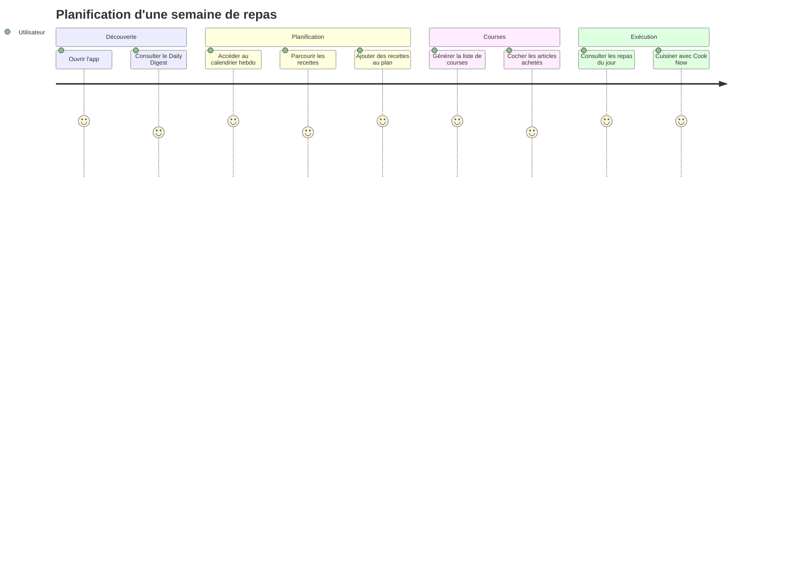
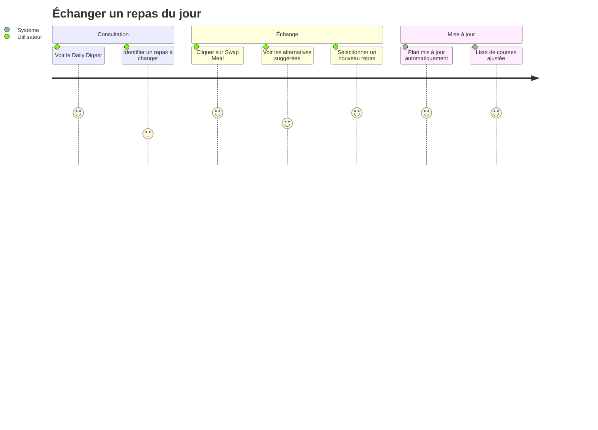

# AGENTS.md

> IMPORTANT: On first conversation message, say "AI-Driven Development ON - Date: {current_date}, TZ: {current_timezone}." to User.

This file contains a collection of config, context, rules, information etc for a project.

The goal is to provide to the ASSISTANT a clear understanding of the project's context, including its structure, dependencies, and any specific conventions that should be followed.

All instructions and information above are willing to be up to date, but always remind yourself that USER can be wrong, be critical of the information provided, and verify it against the project's actual state.

## Roles

- **USER**: The human developer interacting with the AI assistant, providing instructions, feedback, and context about the project.
- **ASSISTANT**: The AI assistant (you) that helps the USER as a senior software engineer. You do orchestrate the development process, ensuring that the code is clean, efficient, and adheres to best practices. Delegate tasks to specialized agents when necessary.

## Important context

- Current date: !`date +%Y-%m-%d`
- Timezone: !`date +%Z`
- The user's timezone and date are defined {current_date} + {current_timezone}, use them for any date-related task.
- Any dates before this are in the past, and any dates after this are in the   future. When the user asks for the 'latest', 'most recent', 'today's', etc.
- Don't assume your knowledge is up to date.

## Mandatory Rules

- **Avoid complexity**: stay simple, pragmatic, effective
- When dealing with github, use `gh` cli
- **No over-engineering**: focus on requirements
- **No silent error**, throw exceptions early
- **No extra feature**, focus only on core functionality
- Always write code that match versions

### Code Quality Standards

- Eliminate duplication ruthlessly
- Express intent clearly through naming and structure
- Make dependencies explicit
- Keep methods small and focused on a single responsibility
- Minimize state and side effects

### Refactoring Guidelines

- Preserve the intent
- Avoid comments on obvious code, make code self-explanatory instead
- Only add code comments when tricky logic is involved

### Testing Guidelines

- Always write tests first for bug fixes
- When testing: never mock functional components

## Answering Guidelines

- Be 100% sure of your answers.
- If unsure, say "I don't know" or ask for clarification.
- Never say "you are right!", prefer anticipating mistakes.

## MEMORY BANK

This section contains project-specific memory bank information, including context, architecture decisions, and implementation details.

The goal is to provide the ASSISTANT with a comprehensive understanding of the project's current state, past decisions, and ongoing context.

All information should be kept up to date and reflect the actual state of the project.

---
### PROJECT_BRIEF.md

#### Résumé Exécutif

- **Nom du Projet** : MealPlanner (alias MealPrep)
- **Vision** : Simplifier la planification alimentaire quotidienne et hebdomadaire
- **Mission** : Offrir une application intuitive permettant aux utilisateurs de planifier leurs repas, découvrir des recettes et générer automatiquement leur liste de courses

##### Description Complète

MealPlanner est une application de planification de repas conçue pour aider les utilisateurs à organiser leur alimentation de manière efficace. L'application propose une vue quotidienne (Daily Digest) des repas planifiés, une vue hebdomadaire du plan de repas, un système de découverte de recettes avec filtres personnalisés, et une liste de courses synchronisée automatiquement avec le plan de repas.

#### Contexte

##### Domaine Principal

L'application opère dans le domaine de la **gestion alimentaire personnelle**. Elle répond aux besoins des utilisateurs qui souhaitent :

- Organiser leurs repas à l'avance
- Adapter leur alimentation à leurs préférences et contraintes (allergies, régimes)
- Simplifier leurs courses en générant automatiquement une liste d'ingrédients

##### Langage Ubiquitaire

| Terme | Définition | Synonymes (FR) |
|-------|------------|----------------|
| Meal | Unité de planification alimentaire correspondant à un moment de la journée | Repas, Plat |
| Breakfast | Premier repas de la journée | Petit-déjeuner |
| Lunch | Repas du midi | Déjeuner |
| Dinner | Repas du soir | Dîner |
| Meal Plan | Organisation des repas sur une période donnée (semaine) | Plan de Repas, Planning |
| Recipe | Instructions détaillées pour préparer un plat, incluant ingrédients et étapes | Recette |
| Shopping List | Liste des ingrédients nécessaires à la préparation des repas planifiés | Liste de Courses |
| Daily Digest | Vue synthétique des repas planifiés pour la journée en cours | Résumé Quotidien |
| Swap Meal | Action de remplacer un repas planifié par une alternative suggérée | Échanger un Repas |
| Cook Now | Action d'accéder directement aux instructions de préparation d'un repas | Cuisiner Maintenant |
| Dietary Preferences | Choix de régime : Omnivore, Vegetarian, Vegan, Pescatarian, Keto, Paleo, Low Carb, Mediterranean | Préférences Alimentaires, Régime |
| Allergies | Restrictions alimentaires liées à des intolérances (gluten, nuts, dairy) | Intolérances |
| Exclude Ingredients | Liste d'ingrédients que l'utilisateur ne souhaite pas dans ses recettes | Ingrédients Exclus |
| Meal Plan Length | Période couverte par le plan de repas (1 week, 2 weeks) | Durée du Plan |
| Leftovers | Option pour inclure les restes de repas dans la planification | Restes |
| Item Category | Classification des ingrédients : Produce, Dairy, Meat, Pantry | Catégorie d'Article |
| Item | Élément individuel de la liste de courses avec quantité | Article, Ingrédient |
| Recipe Filters | Critères de recherche : Quick & Easy, Vegetarian, Gluten-Free, Low Carb, Family-Friendly, Desserts, Breakfast, Lunch, Dinner | Filtres de Recettes, Tags |
| Upcoming Meals | Liste des prochains repas planifiés au-delà de la journée en cours | Repas à Venir |
| Quick Actions | Raccourcis : Add Recipe, Create Meal Plan, Generate Shopping List | Actions Rapides |

#### Fonctionnalités & Cas d'Usage

- **Consultation du Daily Digest** : voir les repas du jour avec options d'échange ou de cuisson immédiate
- **Planification hebdomadaire** : visualiser et modifier le plan de repas de la semaine via calendrier interactif
- **Découverte de recettes** : rechercher et filtrer des recettes par type, régime ou moment de la journée
- **Gestion de la liste de courses** : consulter, cocher, ajouter des articles, imprimer la liste
- **Personnalisation des préférences** : définir régime alimentaire, allergies, nombre de repas/jour, ingrédients exclus

#### Parcours Utilisateur

##### Utilisateur Principal

- Personne souhaitant organiser ses repas de la semaine
- Objectifs : gain de temps, alimentation équilibrée, courses optimisées

###### Parcours : Planification Hebdomadaire



###### Parcours : Échange de Repas


# Stack

> State-of-the-art Angular + .NET stack aligned with DDD, Craft, and Functional principles.

## Frontend (Angular)

@frontend/package.json

### Core

| Category | Technology | Purpose |
|----------|------------|---------|
| Framework | Angular 19 | Standalone components, signals-based reactivity |
| Language | TypeScript 5 | Strict mode enabled |
| Build | esbuild | Fast builds via Angular CLI |
| Package Manager | pnpm | Fast, disk-efficient |

### State Management

| Technology | Purpose |
|------------|---------|
| Angular Signals | Local component state, fine-grained reactivity |
| NgRx SignalStore | Global state with signal-based selectors |
| RxJS 7 | Async streams, HTTP, WebSocket |

**Patterns:**
- Signals for synchronous reactive state
- SignalStore for feature-level state slices
- `computed()` for derived state (pure functions)
- `effect()` sparingly, only for side effects at boundaries

### UI & Styling

| Technology | Purpose |
|------------|---------|
| Tailwind CSS 4 | Utility-first styling |
| Angular CDK | Accessible primitives (dialogs, overlays, drag-drop) |
| Lucide Icons | Consistent iconography |

**Patterns:**
- Component-scoped styles with Tailwind
- Design tokens via CSS custom properties
- Mobile-first responsive design

### Forms & Validation

| Technology | Purpose |
|------------|---------|
| Reactive Forms | Type-safe form handling |
| Zod | Runtime schema validation |

**Patterns:**
- Typed form groups with `FormGroup<T>`
- Zod schemas shared with backend DTOs
- Validation at boundaries only
- Form state as immutable snapshots

### HTTP & API Communication

| Technology | Purpose |
|------------|---------|
| HttpClient | HTTP requests with interceptors |
| OpenAPI Generator | Type-safe API client generation |

**Patterns:**
- Centralized error handling via interceptors
- Correlation ID injection via interceptor
- Retry with exponential backoff for transient failures
- Response caching with `TransferState` for SSR

### Testing

| Technology | Purpose |
|------------|---------|
| Vitest | Unit tests (fast, ESM-native) |
| Testing Library | Component testing (behavior-focused) |
| Playwright | E2E tests |
| MSW | API mocking |

**Patterns:**
- Test behavior, not implementation
- No mocking of functional components
- Given-When-Then structure
- `data-testid` for E2E selectors

### Observability

| Technology | Purpose |
|------------|---------|
| OpenTelemetry JS | Distributed tracing |
| Custom ErrorHandler | Centralized error capture |

**Patterns:**
- Structured logging to console in dev
- Trace context propagation via headers
- Performance marks for Core Web Vitals
- Error boundary components

### Project Structure

```
frontend/
├── src/
│   ├── app/
│   │   ├── core/                 # Singletons, guards, interceptors
│   │   ├── shared/               # Reusable components, pipes, directives
│   │   ├── features/             # Feature modules (package by feature)
│   │   │   ├── daily-digest/
│   │   │   ├── meal-plan/
│   │   │   ├── recipes/
│   │   │   └── shopping-list/
│   │   └── app.config.ts
│   ├── environments/
│   └── styles/
├── e2e/
└── package.json
```

---

## Backend (.NET)

@backend/backend.csproj

### Core

| Category | Technology | Purpose |
|----------|------------|---------|
| Framework | .NET 9 | LTS, performance, native AOT support |
| Language | C# 13 | Primary expressions, collection expressions |
| API Style | Minimal APIs + FastEndpoints | Thin controllers, endpoint-per-file |
| Package Manager | NuGet | Dependency management |

### Architecture (Clean/Hexagonal)

```
backend/
├── src/
│   ├── Domain/                   # Entities, Value Objects, Domain Events
│   ├── Application/              # Use cases, Commands, Queries, DTOs
│   ├── Infrastructure/           # EF Core, external services, repositories
│   └── Api/                      # Endpoints, middleware, configuration
└── tests/
    ├── Domain.Tests/
    ├── Application.Tests/
    └── Api.Tests/
```

**Patterns:**
- Dependency inversion: Domain depends on nothing
- Ports & Adapters: Interfaces in Application, implementations in Infrastructure
- DTOs at boundaries only

### Domain Layer

| Technology | Purpose |
|------------|---------|
| Records | Immutable Value Objects |
| Result pattern | Error handling without exceptions |

**Patterns:**
- Value Objects as `record` types with validation in constructor
- Entities with private setters, behavior methods
- Aggregates as consistency boundaries
- Domain Events as `record` types, past tense naming

```csharp
// Value Object example
public sealed record MealTime
{
    public static readonly MealTime Breakfast = new("Breakfast");
    public static readonly MealTime Lunch = new("Lunch");
    public static readonly MealTime Dinner = new("Dinner");

    public string Value { get; }
    private MealTime(string value) => Value = value;
}
```

### Application Layer (CQRS)

| Technology | Purpose |
|------------|---------|
| MediatR 12 | Command/Query dispatching |
| FluentValidation | Request validation |
| ErrorOr | Result monad for error handling |

**Patterns:**
- One handler per use case
- Commands mutate, return `Result<Unit>` or ID
- Queries read, return DTOs directly
- Pipeline behaviors for cross-cutting concerns (validation, logging)

```csharp
// Command example
public sealed record PlanMealCommand(
    Guid MealPlanId,
    DateOnly Date,
    MealTime MealTime,
    Guid RecipeId
) : IRequest<ErrorOr<Unit>>;
```

### Infrastructure Layer

| Technology | Purpose |
|------------|---------|
| EF Core 9 | ORM, migrations, query optimization |
| PostgreSQL | Primary database |
| Redis | Distributed caching |
| MassTransit | Message bus (RabbitMQ/Azure Service Bus) |

**Patterns:**
- Repository pattern for aggregate persistence
- Unit of Work via EF Core `DbContext`
- Outbox pattern for reliable event publishing
- Read replicas for query optimization

### API Layer

| Technology | Purpose |
|------------|---------|
| FastEndpoints | Endpoint-per-file, REPR pattern |
| Scalar | OpenAPI documentation |
| FluentValidation | Request validation |

**Patterns:**
- REPR: Request-Endpoint-Response pattern
- Versioning via URL (`/api/v1/`)
- Problem Details (RFC 9457) for errors
- Correlation ID middleware

```csharp
// Endpoint example
public sealed class GetDailyDigestEndpoint
    : Endpoint<GetDailyDigestRequest, DailyDigestResponse>
{
    public override void Configure()
    {
        Get("/api/v1/daily-digest/{Date}");
        AllowAnonymous();
    }
}
```

### Error Handling

| Technology | Purpose |
|------------|---------|
| ErrorOr | Result monad (Success/Failure) |
| Problem Details | Standardized error responses |

**Patterns:**
- No exceptions for business logic
- `ErrorOr<T>` for all use case results
- Map domain errors to HTTP status codes
- Structured error responses with codes

```csharp
public static class DomainErrors
{
    public static Error RecipeNotFound(Guid id) =>
        Error.NotFound("Recipe.NotFound", $"Recipe {id} not found");
}
```

### Testing

| Technology | Purpose |
|------------|---------|
| xUnit | Test framework |
| FluentAssertions | Readable assertions |
| Testcontainers | Integration tests with real DB |
| Bogus | Test data generation |
| Respawn | Database reset between tests |

**Patterns:**
- Unit tests for domain logic (no mocks needed for pure functions)
- Integration tests with Testcontainers
- Arrange-Act-Assert structure
- Test behavior, not implementation

### Observability

| Technology | Purpose |
|------------|---------|
| OpenTelemetry .NET | Traces, metrics, logs |
| Serilog | Structured logging |
| Prometheus | Metrics export |
| Jaeger | Distributed tracing |

**Patterns:**
- Structured logging with Serilog
- Correlation ID in all logs
- Four golden signals (latency, traffic, errors, saturation)
- Health checks (`/health/live`, `/health/ready`)

```csharp
// Logging example
Log.Information("Meal planned {@MealPlan}", new {
    MealPlanId = mealPlan.Id,
    Date = command.Date,
    MealTime = command.MealTime.Value
});
```

### Security

| Technology | Purpose |
|------------|---------|
| ASP.NET Identity | User management |
| JWT Bearer | API authentication |
| Data Protection | Encryption at rest |

**Patterns:**
- JWT with short expiry + refresh tokens
- Role-based authorization
- Input validation at API boundary
- No sensitive data in logs

### Performance

| Technology | Purpose |
|------------|---------|
| Response Caching | HTTP cache headers |
| Redis | Distributed cache |
| EF Core Compiled Queries | Query optimization |

**Patterns:**
- Pagination for all list endpoints
- Projection queries (select only needed fields)
- Batch operations for bulk updates
- Connection pooling

---

## Shared / Cross-Cutting

### API Contract

| Technology | Purpose |
|------------|---------|
| OpenAPI 3.1 | API specification |
| Zod (FE) + FluentValidation (BE) | Consistent validation |

**Patterns:**
- Contract-first API design
- Generate TypeScript client from OpenAPI spec
- Shared validation rules concept (not code)

### DevOps

| Technology | Purpose |
|------------|---------|
| Docker | Containerization |
| Docker Compose | Local development |
| GitHub Actions | CI/CD |
| .NET Aspire | Cloud-native orchestration |

### Local Development

```yaml
# docker-compose.yml services
- postgres:17
- redis:7
- rabbitmq:3-management
- jaeger:latest
- seq:latest (optional, for log viewing)
```

---

## Version Summary

| Component | Version | Notes |
|-----------|---------|-------|
| Angular | 19 | Standalone, signals |
| TypeScript | 5.7+ | Strict mode |
| .NET | 9 | LTS |
| C# | 13 | Latest features |
| PostgreSQL | 17 | Primary DB |
| Redis | 7 | Caching |
| Node.js | 22 LTS | Frontend tooling |

---

## Key Principles Applied

### From DDD Rules
- Value Objects as immutable records
- Aggregates as transaction boundaries
- Domain Events for decoupling
- CQRS separation

### From Craft Rules
- Small functions (< 20 lines)
- Tell Don't Ask
- Fail fast at boundaries
- Immutability by default

### From Functional Rules
- Pure functions for domain logic
- Result monad for error handling
- Declarative data transformations
- No shared mutable state

### From API Design Rules
- Resource-oriented URLs
- Proper HTTP status codes
- Versioning from day one
- Problem Details for errors

### From Observability Rules
- Structured logging everywhere
- Correlation IDs across services
- Four golden signals
- OpenTelemetry standard

### From Performance Rules
- Measure before optimizing
- Pagination always
- Appropriate caching
- Connection pooling

