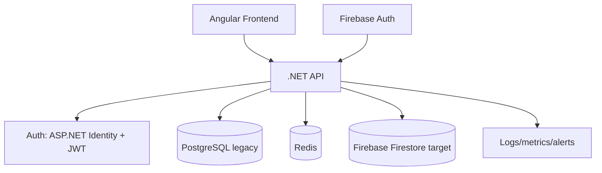
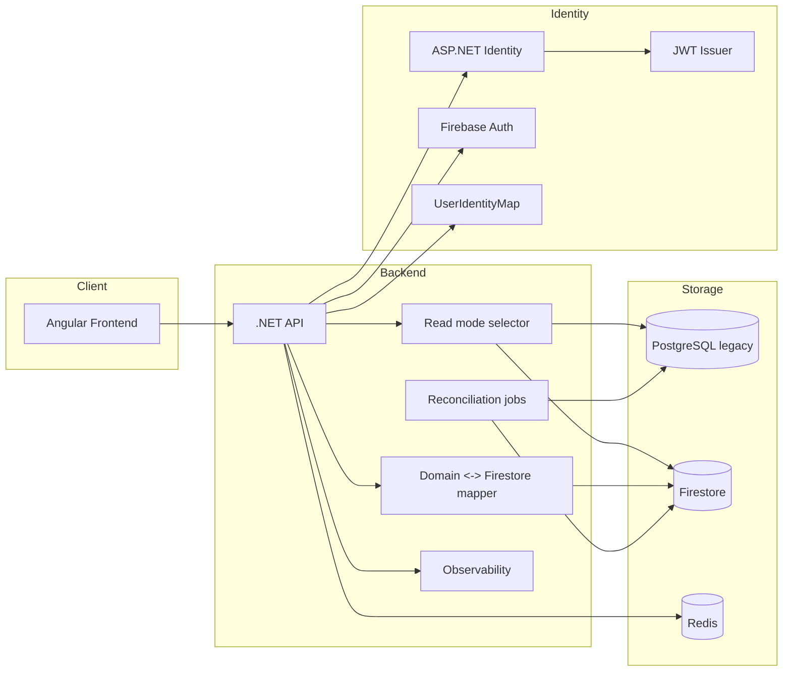

# ADR 2026_02_07 Targeted architecture to include Firestore

- Status: In progress
- Date: 2026-02-07
- Owner: AI + team

## Goal
Replace PostgreSQL as the primary persistence store with Firebase Firestore, without breaking current product flows. Keep a single backend API so the frontend does not talk to Firestore directly.

## Scope
- Backend orchestration and persistence strategy (legacy + Firestore).
- Auth coexistence (ASP.NET Identity + Firebase Auth).
- Per-feature migration and fallback behavior.

## Constraints and assumptions
- ASP.NET Identity + internal JWT remain the source of truth for auth.
- Firebase Auth runs in parallel and is accepted by the backend.
- Frontend only calls the backend API; no direct Firestore access.
- PostgreSQL stays available during migration as the legacy store.
- Migration is feature-by-feature with dual-write then read switch.

## Target architecture (high level)

## Target architecture (detailed scheme)

### Backend responsibilities
- Accept both internal JWT and Firebase ID tokens.
- Resolve a unified user identity via a UserIdentityMap.
- Enforce a per-feature read mode:
  - Read legacy / Write dual (default at start).
  - Read Firestore / Write dual (after stabilization).
  - Read Firestore / Write Firestore only (final state).
- Provide consistent DTOs to the frontend regardless of storage.

### Storage mode switch (global)
To support safe migrations and incident recovery, the backend must allow a global override:
- Firestore only: all reads and writes use Firestore.
- PostgreSQL only: all reads and writes use PostgreSQL.
- Per-feature mode (default): use the feature-level read/write policy above.

### User identity mapping
- Maintain a mapping table: UserIdentityMap(AspNetUserId, FirebaseUid, CreatedAt).
- Used by the API to correlate legacy users with Firebase identities.

### Feature migration order (initial candidates)
- Pilot: user preferences, shopping list.
- Later: weekly plan, recipes.

## Challenges and risks
- Data divergence during dual-write.
- Identity mismatch between JWT and Firebase ID token flows.
- Firestore index design and query constraints compared to SQL.
- Latency variance and cache invalidation across two stores.
- Operational complexity: monitoring, reconciliation, and rollback.

## Mitigations
- Add reconciliation jobs and compare logs for divergence detection.
- Define a strict mapping layer between domain models and Firestore documents.
- Design required Firestore indexes before enabling reads.
- Keep a fallback to legacy reads per feature until stable.
- Instrument read/write paths with correlation IDs and metrics.

## Migration phases (per feature)
1. Read legacy / Write dual.
2. Validate parity via reconciliation and observability.
3. Switch reads to Firestore; keep dual-write.
4. Disable legacy writes after stabilization.

## Decision summary
We will keep a single backend API that orchestrates both legacy PostgreSQL and Firestore. The frontend remains unchanged. Auth accepts both JWT and Firebase ID token, unified via a UserIdentityMap. Migration proceeds per feature with dual-write, reconciliation, and a legacy fallback until stable.
