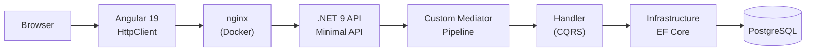
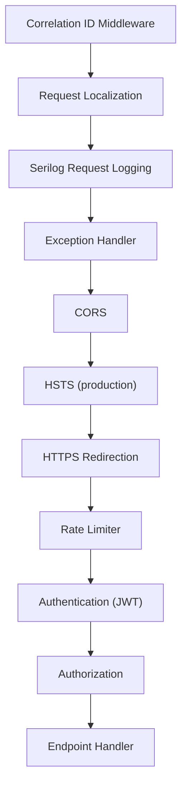
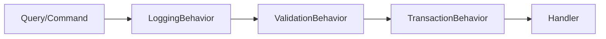
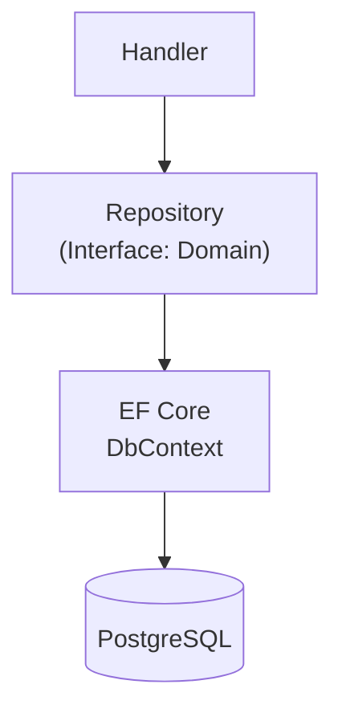
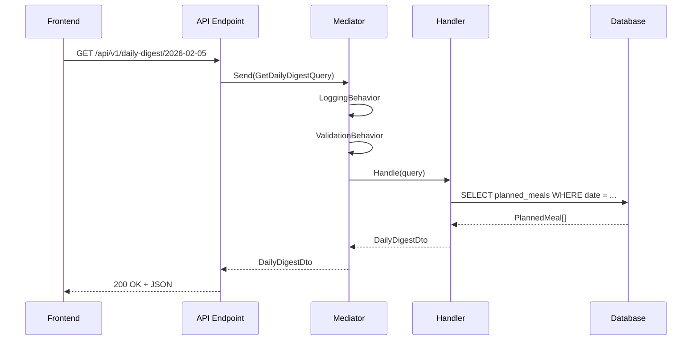
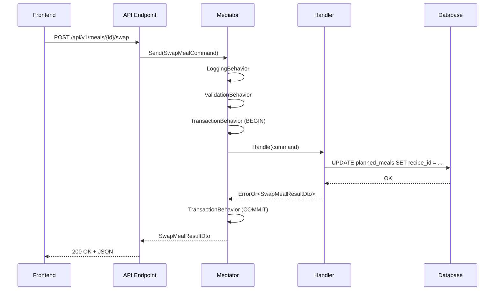
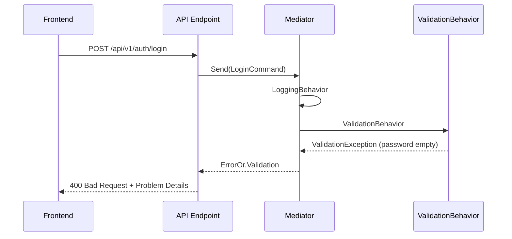
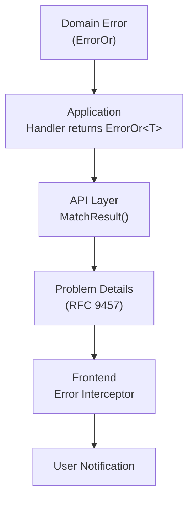

# Architecture des flux API

Cette page explique le flux d'une requête depuis le frontend Angular jusqu'à la base de données, en passant par l'API .NET.

## Vue d'ensemble



---

## Flux détaillé d'une requête

### 1. Frontend (Angular)

L'utilisateur interagit avec un composant Angular qui appelle un service du dossier `core/services/`.

```
frontend/src/app/
├── features/daily-digest/         # Composant UI
└── core/services/
    └── daily-digest.service.ts    # Appel HTTP
```

Le service utilise `HttpClient` pour envoyer la requête :

```typescript
// daily-digest.service.ts
getDailyDigest(date: string): Observable<DailyDigest> {
  return this.http.get<DailyDigest>(`${this.baseUrl}/daily-digest/${date}`);
}
```

**Intercepteurs** appliqués automatiquement :

- **Auth Interceptor** : Ajoute le header `Authorization: Bearer <token>`
- **Correlation ID Interceptor** : Ajoute le header `X-Correlation-ID`
- **Accept-Language Interceptor** : Ajoute la langue courante

### 2. API Layer (.NET Minimal API)

La requête arrive dans `Program.cs` où les endpoints sont définis :

```
backend/src/Api/MealPlanner.Api/
└── Program.cs                     # Endpoints + middleware
```

```csharp
app.MapGet("/api/v1/daily-digest/{date}", async (DateOnly date, IMediator mediator) =>
{
    var query = new GetDailyDigestQuery(date);
    var result = await mediator.Send(query);
    return Results.Ok(result);
})
.RequireAuthorization();
```

**Middleware pipeline** (ordre d'exécution) :



### 3. Mediator + Pipeline Behaviors

Le `IMediator` dispatche la requête vers le handler correspondant. Avant d'atteindre le handler, la requête traverse les **pipeline behaviors** :



| Behavior | Rôle |
|----------|------|
| `LoggingBehavior` | Journalise la requête, la durée d'exécution et le résultat |
| `ValidationBehavior` | Valide la requête avec FluentValidation, retourne `400` si invalide |
| `TransactionBehavior` | Encadre les Commands dans une transaction EF Core |

```
backend/src/Application/MealPlanner.Application/
├── Common/
│   ├── Mediator/                  # IMediator, IRequest, IRequestHandler
│   └── Behaviors/                 # Pipeline behaviors
└── DailyDigest/
    ├── GetDailyDigestQuery.cs     # Query definition
    └── GetDailyDigestHandler.cs   # Handler implementation
```

### 4. Application Layer (Handlers)

Le handler exécute la logique métier en utilisant les interfaces du domaine :

```csharp
// GetDailyDigestHandler.cs
public sealed class GetDailyDigestHandler
    : IRequestHandler<GetDailyDigestQuery, DailyDigestDto>
{
    public async Task<DailyDigestDto> Handle(
        GetDailyDigestQuery query, CancellationToken ct)
    {
        var meals = await _plannedMealRepository.GetByDateAsync(query.Date, ct);
        return MapToDto(meals);
    }
}
```

**Pattern CQRS** :

| Type | Interface | Retour | Usage |
|------|-----------|--------|-------|
| Query | `IRequest<TResponse>` | DTO directement | Lecture seule |
| Command | `IRequest<ErrorOr<TResponse>>` | Result monad | Mutation avec gestion d'erreur |

### 5. Infrastructure Layer

Les repositories implémentent les interfaces définies dans le domaine :

```
backend/src/Infrastructure/MealPlanner.Infrastructure/
└── Persistence/
    ├── MealPlannerDbContext.cs     # EF Core DbContext
    └── Repositories/              # Repository implementations
```



---

## Flux par type d'opération

### Lecture (Query)



### Écriture (Command)



### Erreur de validation



---

## Organisation du code par feature

Chaque fonctionnalité suit la même structure dans les deux couches :

```
Frontend                              Backend
────────                              ───────
features/daily-digest/                Application/DailyDigest/
├── daily-digest.component.ts         ├── GetDailyDigestQuery.cs
├── daily-digest.component.html       ├── GetDailyDigestHandler.cs
└── daily-digest.component.spec.ts    └── DailyDigestDto.cs

core/services/
└── daily-digest.service.ts           Domain/Meals/
    (HttpClient → /api/v1/...)        └── IPlannedMealRepository.cs
```

---

## Gestion des erreurs à travers les couches



| Couche | Mécanisme |
|--------|-----------|
| Domain | `Error.NotFound()`, `Error.Conflict()`, `Error.Validation()` |
| Application | `ErrorOr<T>` comme type de retour |
| API | `MatchResult()` extension convertit en HTTP status |
| Frontend | Intercepteur HTTP global + messages localisés |
