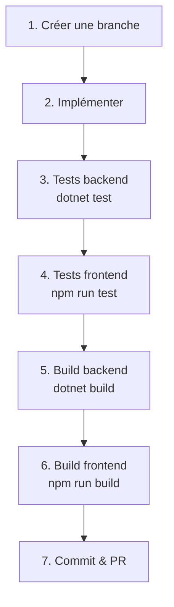

# Getting Started

Guide de démarrage rapide pour les nouveaux développeurs rejoignant le projet MealPlanner.

## Prérequis

| Outil | Version | Vérification |
|-------|---------|-------------|
| .NET SDK | 9.0+ | `dotnet --version` |
| Node.js | 22 LTS | `node --version` |
| npm | 10+ | `npm --version` |
| Docker & Docker Compose | Latest | `docker --version` |
| Git | Latest | `git --version` |

---

## Installation rapide

### 1. Cloner le projet

```bash
git clone <repository-url>
cd kata-meal-planner
```

### 2. Démarrer l'infrastructure (PostgreSQL + Redis)

```bash
cp .env.example .env
docker-compose up -d postgres redis
```

Vérifier que les services sont prêts :

```bash
docker-compose ps
```

### 3. Démarrer le backend

```bash
dotnet run --project backend/src/Api/MealPlanner.Api
```

Le backend démarre sur `http://localhost:5000` et effectue automatiquement :

- Application des migrations EF Core
- Seeding de la base de données (utilisateurs Emmanuel, Gabrielle + recettes)

Vérifier :

```bash
curl http://localhost:5000/health/live
# {"status":"Healthy","totalDuration":0.5,"checks":[]}

curl http://localhost:5000/health/ready
# {"status":"Healthy","totalDuration":45.2,"checks":[{"name":"postgresql","status":"Healthy",...}]}
```

### 4. Démarrer le frontend

```bash
cd frontend
npm install
npm start
```

Le frontend démarre sur `http://localhost:4200`.

### 5. Se connecter

Utilisateurs seeded disponibles :

| Username | Mot de passe | Admin |
|----------|-------------|-------|
| Emmanuel | `MealPlanner123!` | Oui |
| Gabrielle | `MealPlanner123!` | Oui |

---

## Alternative : Docker Compose (tout-en-un)

Pour démarrer l'ensemble de la stack :

```bash
cp .env.example .env
docker-compose up -d
```

| Service | URL |
|---------|-----|
| Frontend | http://localhost:4200 |
| Backend API | http://localhost:5000 |
| PostgreSQL | localhost:5432 |
| Redis | localhost:6379 |

---

## Premier appel API

### Obtenir un token

```bash
curl -X POST http://localhost:5000/api/v1/auth/login \
  -H "Content-Type: application/json" \
  -d '{"username": "Emmanuel", "password": "MealPlanner123!"}'
```

Réponse :

```json
{
  "accessToken": "eyJhbGc...",
  "refreshToken": "eyJhbGc...",
  "accessTokenExpiresAt": "2026-02-05T15:30:00Z",
  "refreshTokenExpiresAt": "2026-02-12T14:00:00Z",
  "userId": "...",
  "username": "Emmanuel"
}
```

### Utiliser le token

```bash
# Stocker le token
TOKEN=$(curl -s -X POST http://localhost:5000/api/v1/auth/login \
  -H "Content-Type: application/json" \
  -d '{"username": "Emmanuel", "password": "MealPlanner123!"}' \
  | python3 -c "import sys,json; print(json.load(sys.stdin)['accessToken'])")

# Appeler un endpoint protégé
curl http://localhost:5000/api/v1/daily-digest/2026-02-05 \
  -H "Authorization: Bearer $TOKEN"

# Consulter les recettes
curl "http://localhost:5000/api/v1/recipes" \
  -H "Authorization: Bearer $TOKEN"

# Voir le plan hebdomadaire
curl http://localhost:5000/api/v1/weekly-plan/2026-02-03 \
  -H "Authorization: Bearer $TOKEN"
```

---

## Structure du projet

```
kata-meal-planner/
├── frontend/                    # Angular 19 (port 4200)
│   ├── src/app/features/        # Composants par feature
│   └── src/app/core/services/   # Services HTTP
├── backend/
│   ├── src/Domain/              # Entités, Value Objects
│   ├── src/Application/         # CQRS handlers, DTOs
│   ├── src/Infrastructure/      # EF Core, repositories
│   └── src/Api/                 # Endpoints, middleware
├── docs/                        # Documentation MkDocs
└── docker-compose.yml           # Infrastructure locale
```

Pour plus de détails, voir [Structure du Code](../memory-bank/CODEBASE_STRUCTURE.md).

---

## Commandes utiles

### Backend

```bash
# Build
dotnet build backend/MealPlanner.sln

# Tests
dotnet test backend/MealPlanner.sln

# Run
dotnet run --project backend/src/Api/MealPlanner.Api

# Ajouter une migration EF Core
dotnet ef migrations add <NomMigration> \
  --project backend/src/Infrastructure/MealPlanner.Infrastructure \
  --startup-project backend/src/Api/MealPlanner.Api
```

### Frontend

```bash
cd frontend

# Build
npm run build

# Tests
npm run test

# Tests avec couverture
npm run test:coverage

# Dev server
npm start
```

### Documentation

```bash
# Prévisualiser la documentation
npm run docs:serve

# Générer le site statique
npm run docs:build
```

### Docker

```bash
# Démarrer tout
docker-compose up -d

# Voir les logs
docker-compose logs -f api

# Rebuilder après changements
docker-compose up -d --build

# Arrêter et nettoyer
docker-compose down -v
```

---

## Workflow de développement



### Checklist avant commit

- [ ] `dotnet build` passe sans erreur
- [ ] `dotnet test` passe (tous les tests)
- [ ] `npm run build` passe sans erreur
- [ ] `npm run test` passe (tous les tests)
- [ ] Pas de code dupliqué
- [ ] Pas de code commenté

---

## Ressources

| Ressource | Lien |
|-----------|------|
| Endpoints API | [Référence complète](endpoints.md) |
| Architecture des flux | [Flux Frontend → API → Handlers](architecture.md) |
| Conventions Backend | [Conventions .NET](../memory-bank/backend/CONVENTIONS.md) |
| Conventions Frontend | [Conventions Angular](../memory-bank/frontend/CONVENTIONS.md) |
| Design System | [Design & Tailwind](../memory-bank/frontend/DESIGN.md) |
| Deployment | [Docker & CI/CD](../memory-bank/infra/DEPLOYMENT.md) |
