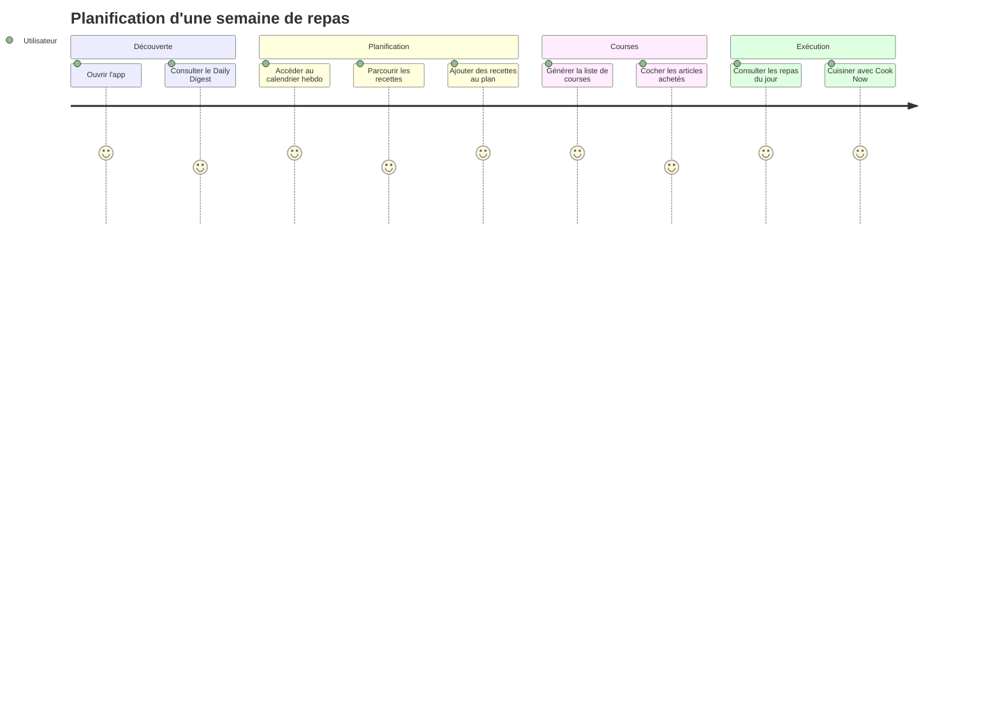
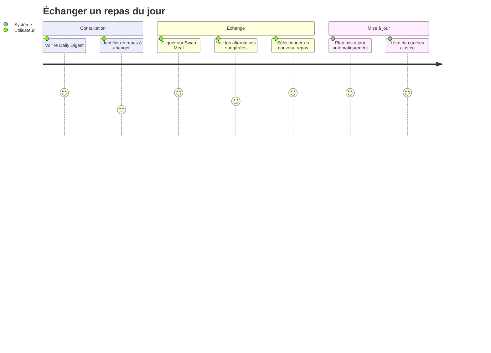

# PROJECT_BRIEF.md

## Résumé Exécutif

- **Nom du Projet** : MealPlanner (alias MealPrep)
- **Vision** : Simplifier la planification alimentaire quotidienne et hebdomadaire
- **Mission** : Offrir une application intuitive permettant aux utilisateurs de planifier leurs repas, découvrir des recettes et générer automatiquement leur liste de courses

### Description Complète

MealPlanner est une application de planification de repas conçue pour aider les utilisateurs à organiser leur alimentation de manière efficace. L'application propose une vue quotidienne (Daily Digest) des repas planifiés, une vue hebdomadaire du plan de repas, un système de découverte de recettes avec filtres personnalisés, et une liste de courses synchronisée automatiquement avec le plan de repas.

## Contexte

### Domaine Principal

L'application opère dans le domaine de la **gestion alimentaire personnelle**. Elle répond aux besoins des utilisateurs qui souhaitent :

- Organiser leurs repas à l'avance
- Adapter leur alimentation à leurs préférences et contraintes (allergies, régimes)
- Simplifier leurs courses en générant automatiquement une liste d'ingrédients

### Langage Ubiquitaire

| Terme | Définition | Synonymes (FR) |
|-------|------------|----------------|
| Meal | Unité de planification alimentaire correspondant à un moment de la journée | Repas, Plat |
| Breakfast | Premier repas de la journée | Petit-déjeuner |
| Lunch | Repas du midi | Déjeuner |
| Dinner | Repas du soir | Dîner |
| Meal Plan | Organisation des repas sur une période donnée (semaine) | Plan de Repas, Planning |
| Recipe | Instructions détaillées pour préparer un plat, incluant ingrédients et étapes | Recette |
| Shopping List | Liste des ingrédients nécessaires à la préparation des repas planifiés | Liste de Courses |
| Daily Digest | Vue synthétique des repas planifiés pour la journée en cours | Résumé Quotidien |
| Swap Meal | Action de remplacer un repas planifié par une alternative suggérée | Échanger un Repas |
| Cook Now | Action d'accéder directement aux instructions de préparation d'un repas | Cuisiner Maintenant |
| Dietary Preferences | Choix de régime : None, Vegetarian, Vegan, Pescatarian, Keto, Paleo, Low Carb, Mediterranean | Préférences Alimentaires, Régime |
| Allergies | Restrictions alimentaires liées à des intolérances (gluten, nuts, dairy, eggs, shellfish, soy) | Intolérances |
| Exclude Ingredients | Liste d'ingrédients que l'utilisateur ne souhaite pas dans ses recettes | Ingrédients Exclus |
| Meal Plan Length | Période couverte par le plan de repas (1 week, 2 weeks) | Durée du Plan |
| Leftovers | Option pour inclure les restes de repas dans la planification | Restes |
| Item Category | Classification des ingrédients : Produce, Dairy, Meat, Pantry | Catégorie d'Article |
| Item | Élément individuel de la liste de courses avec quantité | Article, Ingrédient |
| Recipe Filters | Critères de recherche : Quick & Easy, Vegetarian, Gluten-Free, Low Carb, Family-Friendly, Desserts, Breakfast, Lunch, Dinner | Filtres de Recettes, Tags |
| Upcoming Meals | Liste des prochains repas planifiés au-delà de la journée en cours | Repas à Venir |
| Quick Actions | Raccourcis : Add Recipe, Create Meal Plan, Generate Shopping List | Actions Rapides |

## Fonctionnalités & Cas d'Usage

- **Consultation du Daily Digest** : voir les repas du jour avec options d'échange ou de cuisson immédiate
- **Planification hebdomadaire** : visualiser et modifier le plan de repas de la semaine via calendrier interactif
- **Découverte de recettes** : rechercher et filtrer des recettes par type, régime ou moment de la journée
- **Gestion de la liste de courses** : consulter, cocher, ajouter des articles, imprimer la liste
- **Personnalisation des préférences** : définir régime alimentaire, allergies, nombre de repas/jour, ingrédients exclus

## Parcours Utilisateur

### Utilisateur Principal

- Personne souhaitant organiser ses repas de la semaine
- Objectifs : gain de temps, alimentation équilibrée, courses optimisées

#### Parcours : Planification Hebdomadaire

#### Parcours : Échange de Repas

