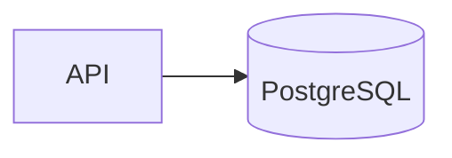
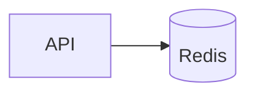

# Architecture

- [Language/Framework](#languageframework)
  - [Frontend](#frontend)
  - [Backend](#backend)
    - [Database](#database)
- [Full project structure](#full-project-structure)
  - [Naming Conventions](#naming-conventions)
- [Services communication](#services-communication)
  - [Frontend to API](#frontend-to-api)
  - [External Services](#external-services)
    - [PostgreSQL](#postgresql)
    - [Redis](#redis)

## Language/Framework

### Frontend

- **Framework**: Angular 19 → @frontend/package.json
- **UI Library**: Tailwind CSS → @frontend/tailwind.config.js
- **Routing**: Angular Router (feature routes) → @frontend/src/app/app.routes.ts
- **Data Fetching**: Angular `HttpClient` via core services → @frontend/src/app/core/services
- **Form Handling**: Reactive Forms → @frontend/package.json
- **Validation**: Form validators (built-in) → @frontend/src/app
- **State Management**: Local component state (signals) → @frontend/src/app
- **Build Tool**: Angular CLI (esbuild) → @frontend/angular.json
- **Structure**: feature-first + core/shared → @frontend/src/app

### Backend

- **Language/Framework**: .NET 9 / ASP.NET Core Minimal API → @backend/MealPlanner.sln, @backend/src/Api/MealPlanner.Api/Program.cs
- **API Style**: REST, endpoint-per-route → @backend/src/Api/MealPlanner.Api/Program.cs
- **Architecture**: Clean Architecture + DDD layers → @backend/src
- **ORM**: EF Core → @backend/src/Infrastructure/MealPlanner.Infrastructure
- **Schema path**: EF Core migrations → @backend/src/Infrastructure/MealPlanner.Infrastructure/Persistence/Migrations
- **Endpoints**: Minimal API mappings → @backend/src/Api/MealPlanner.Api/Program.cs
- **Database**: PostgreSQL → @backend/src/Api/MealPlanner.Api/appsettings.json, @docker-compose.yml
- **Caching**: Redis → @backend/src/Api/MealPlanner.Api/appsettings.json, @docker-compose.yml
- **Testing**: xUnit (solution tests) → @backend/tests

#### Database

- **Type**: PostgreSQL 17
- **ORM/Driver**: EF Core + Npgsql
- **Connection**: ConnectionStrings.DefaultConnection → @backend/src/Api/MealPlanner.Api/appsettings.json
- **Migration**: Auto-apply on dev startup → @backend/src/Api/MealPlanner.Api/Program.cs
- **Seeding**: Development seeder → @backend/src/Api/MealPlanner.Api/Program.cs
- **Mock**: InMemory repositories (dev) → @backend/src/Infrastructure/MealPlanner.Infrastructure

## Full project structure

```text
kata-meal-planner/
├── frontend/                    # Angular app
├── backend/                     # .NET API + Clean Architecture
├── docs/                        # Documentation + memory bank
├── aidd/                        # AI-driven dev config
├── docker-compose.yml           # Local infra
├── docker-compose.override.yml  # Dev overrides
└── prd.json                     # Product requirements
```

### Naming Conventions

- **Files**: frontend uses kebab-case (e.g., daily-digest.service.ts), backend uses PascalCase (C#)
- **Components**: Angular components PascalCase (class), kebab-case selectors
- **Functions**: camelCase (TypeScript), PascalCase for C# methods
- **Variables**: camelCase
- **Constants**: UPPER_CASE (TypeScript)
- **Types/Interfaces**: PascalCase

## Services communication

### Frontend to API

```mermaid
graph LR
  UI[Angular UI] --> Svc[Core Services (HttpClient)]
  Svc --> API[ASP.NET Core API /api/v1]
  API --> Med[MediatR + Application]
  Med --> Infra[Infrastructure]
  Infra --> DB[(PostgreSQL)]
  Infra --> Cache[(Redis)]
```

### External Services

#### PostgreSQL



#### Redis


